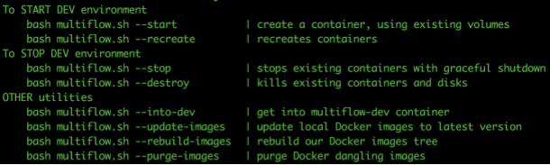
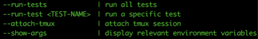
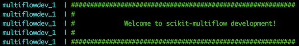

In order to ease scikit-multiflow development, we developed a set of 
developer tools. With them we aim to
 - provide zero setup-time to get started with development
 - deliver same experience to all developers, regardless underlying OS
 - provide same environment and tools to reproduce issues

The main script for development is ``multiflow.sh`` located in project's 
root folder.

## Starting scikit-multiflow development

### multiflow.sh --help
``multiflow.sh`` provides multiple options, which are listed based on 
the context in which the script is executed (inside / outside the 
Docker instance). 

Options provided from user's machine:

Options provided once in Docker instance:

### Requirements & development
 - ensure [Docker](https://www.docker.com/) is installed
 - use your IDE of preference. All changes in code will be automatically 
 mirrored to the Docker instance
 - to start the Docker instance, run ``multiflow.sh --start``
 - to run the tests, from your dev console execute: 
     - ``multiflow.sh --into-dev``, to get into the multiflow dev Docker instance
     - ``multiflow.sh --run-test <path-to-test>``, to run a multiflow test
     - ``multiflow.sh --run-tests``, to run all multiflow tests
     
After running the ``multiflow.sh --start`` command, you should see 
the following message telling the multiflow dev instance is up and running:

 

